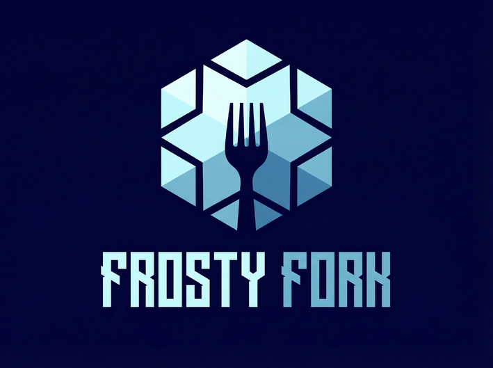

# 🎄 The Frosty Fork

<div align="center">



**A Premium Winter Dining Experience**

Experience the magic of winter dining at The Frosty Fork - where culinary excellence meets festive cheer.

[Live Demo](https://frost-fork.hulobiral.online) • [Report Bug](https://github.com/hul0/frost-fork/issues) • [Request Feature](https://github.com/hul0/frost-fork/issues)

[](https://opensource.org/licenses/MIT)
[](https://github.com/hul0/frost-fork)

</div>

---

## 🎅 About The Project

The Frosty Fork is a beautifully crafted, fully responsive restaurant website designed to bring the warmth and magic of Christmas to your screen. Built with modern web technologies, it features immersive animations, interactive elements, and a seamless user experience that captures the spirit of the holiday season.

Located in Garia, Kolkata, The Frosty Fork offers a curated menu of festive warmers, savory Christmas delights, and sweet holiday treats, all presented through an elegant and engaging web interface.

### ✨ Key Highlights

- 🎨 **Stunning Visual Design** - Aurora-inspired gradients, animated snow effects, and festive decorations
- 🎵 **Interactive Music Player** - Vintage vinyl-style player with custom Christmas playlist
- 🛒 **Smart Shopping Cart** - Sleigh-themed cart with smooth drawer animations
- ⏱️ **Live Countdown** - Real-time countdown to Christmas Day
- 🎯 **Menu Filtering** - Dynamic filtering system for easy menu navigation
- 📱 **Fully Responsive** - Optimized for all devices from mobile to desktop
- ♿ **Accessible** - Built with semantic HTML and ARIA labels
- 🔍 **SEO Optimized** - Complete meta tags, Open Graph, and Schema.org markup

---

## 🚀 Features

### 🎭 Interactive Elements

- **Animated Snow Canvas** - Realistic falling snow effect using HTML5 Canvas
- **Parallax Scrolling** - Depth effects on background elements
- **GSAP Animations** - Smooth scroll-triggered animations throughout
- **Christmas Lights** - Twinkling decorative lights border
- **Decorated Trees** - Animated Christmas trees with ornaments

### 🍽️ Menu System

- **Dynamic Menu Grid** - Responsive card layout with hover effects
- **Category Filtering** - Filter by Warmers, Sweets, Savory, or view All
- **Add to Cart** - Smooth animations when adding items
- **Item Details** - Beautiful cards with images, descriptions, and pricing

### 🎶 Music Player

- **Vintage Vinyl Design** - Rotating disc with animated music notes
- **Full Controls** - Play/pause, volume control, and progress tracking
- **Collapsible Interface** - Minimizes to disc-only view
- **Time Display** - Current time and total duration

### 🛒 Shopping Cart

- **Slide-out Drawer** - Smooth animations with backdrop blur
- **Quantity Management** - Increase/decrease item quantities
- **Live Total** - Real-time price calculation
- **Empty State** - Friendly message when cart is empty
- **Persistent Badge** - Cart item count in navigation

### 🍪 Additional Features

- **Cookie Consent** - GDPR-compliant cookie notice with animated GIF
- **Toast Notifications** - Elegant feedback for user actions
- **Newsletter Signup** - Email subscription form
- **Social Links** - GitHub, Twitter, YouTube integration
- **Contact Information** - Phone, email, and location details

---

## 🛠️ Built With

### Core Technologies

- **HTML5** - Semantic markup with Schema.org structured data
- **CSS3** - Modern styling with custom properties and animations
- **JavaScript (ES6+)** - Vanilla JS for all interactions
- **TailwindCSS** - Utility-first CSS framework

### Libraries & Tools

- **[GSAP](https://greensock.com/gsap/)** (v3.12.2) - Professional-grade animation library
- **[ScrollTrigger](https://greensock.com/scrolltrigger/)** - Scroll-based animations
- **[Font Awesome](https://fontawesome.com/)** (v6.4.0) - Icon library
- **[Google Fonts](https://fonts.google.com/)** - Custom typography
  - Cinzel - Elegant header font
  - Lato - Clean body font
  - Mountains of Christmas - Festive display font

### Design Features

- Custom Tailwind configuration
- CSS animations and keyframes
- Glassmorphism effects
- Gradient backgrounds
- Custom color palette
- Responsive breakpoints

---

## 📦 Installation

### Prerequisites

- A modern web browser (Chrome, Firefox, Safari, Edge)
- A local development server (optional, for testing)

### Quick Start

1. **Clone the repository**
   ```bash
   git clone https://github.com/hul0/frost-fork.git
   cd frost-fork
   ```

2. **File Structure**
   ```
   frost-fork/
   ├── index.html          # Main HTML file
   ├── styles.css          # Custom CSS styles
   ├── script.js           # JavaScript functionality
   ├── christmas.mp3       # Background music
   ├── logo.jpg            # Restaurant logo
   ├── preview.webp        # Preview image
   └── README.md           # This file
   ```

3. **Open in browser**
   - Simply open `index.html` in your browser, or
   - Use a local server (recommended):
   
   ```bash
   # Using Python
   python -m http.server 8000
   
   # Using Node.js
   npx serve
   
   # Using PHP
   php -S localhost:8000
   ```

4. **Navigate to**
   ```
   http://localhost:8000
   ```

---

## 🎯 Usage

### For Developers

#### Customizing the Menu

The menu items are dynamically loaded via JavaScript. To modify menu items, edit the `menuItems` array in `script.js`:

```javascript
const menuItems = [
  {
    id: 1,
    name: "Your Item Name",
    category: "warm", // warm, sweet, or savory
    description: "Delicious description",
    price: 12.99,
    emoji: "☕"
  },
  // Add more items...
];
```

#### Changing Colors

Modify the Tailwind configuration in `index.html`:

```javascript
tailwind.config = {
  theme: {
    extend: {
      colors: {
        "christmas-red": "#c41e3a",
        "christmas-green": "#165b33",
        // Add your colors...
      }
    }
  }
};
```

#### Adjusting Animations

Edit animation speeds in the CSS custom properties or Tailwind config:

```javascript
animation: {
  'aurora-move': 'aurora 20s ease infinite',
  'pulse-gold': 'pulseGold 2s infinite',
  // Customize...
}
```

### For Restaurant Owners

#### Update Contact Information

1. **Phone Number**: Search for `+91959303XXXX` and replace
2. **Email**: Search for `hulo@hulobiral.online` and replace
3. **Address**: Update the address in the footer section
4. **Hours**: Modify the opening hours in Schema.org data

#### Change Restaurant Name

Replace "The Frosty Fork" throughout:
- Page title
- Navigation logo
- Footer
- Meta tags
- Schema.org data

#### Add Your Logo

Replace `logo.jpg` with your restaurant's logo (recommended: 512x512px)

#### Update Social Links

Modify social media links in the footer:
```html
<a href="https://github.com/yourusername">...</a>
<a href="https://x.com/yourusername">...</a>
```

---

## 🎨 Customization Guide

### Color Schemes

The website uses a Christmas-themed color palette. To create your own theme:

1. **Primary Colors**: Red (`#c41e3a`) and Green (`#165b33`)
2. **Accent**: Gold (`#ffd700`)
3. **Background**: Dark blues for contrast
4. **Text**: White and light grays

### Typography

Three font families are used:
- **Cinzel**: Elegant headers
- **Lato**: Body text
- **Mountains of Christmas**: Festive titles

Change fonts in the Google Fonts link and CSS variables.

### Layout Modifications

The site uses CSS Grid and Flexbox. Key breakpoints:
- Mobile: < 768px
- Tablet: 768px - 1024px
- Desktop: > 1024px

---

## 📱 Browser Support

- ✅ Chrome (latest)
- ✅ Firefox (latest)
- ✅ Safari (latest)
- ✅ Edge (latest)
- ⚠️ IE11 (not supported)

---

## 🤝 Contributing

Contributions make the open-source community amazing! Any contributions you make are **greatly appreciated**.

1. Fork the Project
2. Create your Feature Branch (`git checkout -b feature/AmazingFeature`)
3. Commit your Changes (`git commit -m 'Add some AmazingFeature'`)
4. Push to the Branch (`git push origin feature/AmazingFeature`)
5. Open a Pull Request

---

## 📝 License

Distributed under the MIT License. See `LICENSE` for more information.

---

## 👨‍💻 Author

**Hulo** (Hulo Biral Cybersec)

- Website: [hulobiral.online](https://frost-fork.hulobiral.online)
- GitHub: [@hul0](https://github.com/hul0)
- Twitter: [@hulocyber](https://x.com/hulocyber)
- YouTube: [@hulocyber](https://youtube.com/@hulocyber)
- Email: hulo@hulobiral.online
- Phone: +919593035680

---

## 🙏 Acknowledgments

- [TailwindCSS](https://tailwindcss.com/) - For the utility-first CSS framework
- [GSAP](https://greensock.com/) - For smooth animations
- [Font Awesome](https://fontawesome.com/) - For beautiful icons
- [Google Fonts](https://fonts.google.com/) - For typography
- [Tenor](https://tenor.com/) - For the cookie GIF

---

## 📊 Project Stats

- **Lines of Code**: ~2000+
- **Files**: 5 core files
- **Dependencies**: 4 external libraries
- **Responsive Breakpoints**: 3
- **Animations**: 15+ custom animations
- **Interactive Features**: 8 major features

---

## 🎄 Special Notes

This project was created by hul0 for Akriti - Phase 2 (by Byte Brigades). It showcases modern web development techniques including:

- Progressive enhancement
- Mobile-first design
- Accessibility best practices
- Performance optimization
- SEO optimization

Perfect for restaurants, cafes, bakeries, or any food business looking to add festive cheer to their online presence!

---

<div align="center">

**Made with ❄️ HTML & ❤️ CSS**

⭐ Star this repo if you found it helpful! ⭐

[🔝 Back to Top](#-the-frosty-fork)

</div>